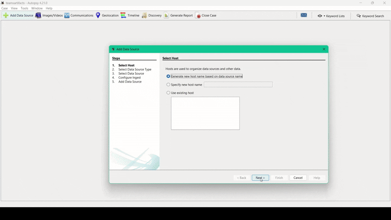

# Microsoft Teams JSON Artifacts Parser for Autopsy

This Autopsy ingest module parses Microsoft Teams artifacts exported as JSON, providing forensic examiners with a structured and reliable visualization of communications, user activities, and metadata.

## Overview
The module processes Teams JSON files (exported via [DFIndexedDB](https://github.com/google/dfindexeddb.git)) through a modular and maintainable architecture.

Key features include:
- Structured parsing of messages, calls, meetings, reactions, mentions, and user interactions.  
- Seamless integration into the Autopsy platform.  
- Streamlined investigation workflows.  
- Clean, documented, and extensible codebase.  

## Demo

## Usage
1. Extract the required data using **DFIndexedDB**. For detailed steps, see the [data-extraction/README](./data-extraction/README.md).  

2. Follow the instructions in the [teamsartifacts/README](./teamsartifacts/README.md) to install and run the module within Autopsy.  

## Support
For questions, issues, or contributions, feel free to open an issue or contact the module author via email.
